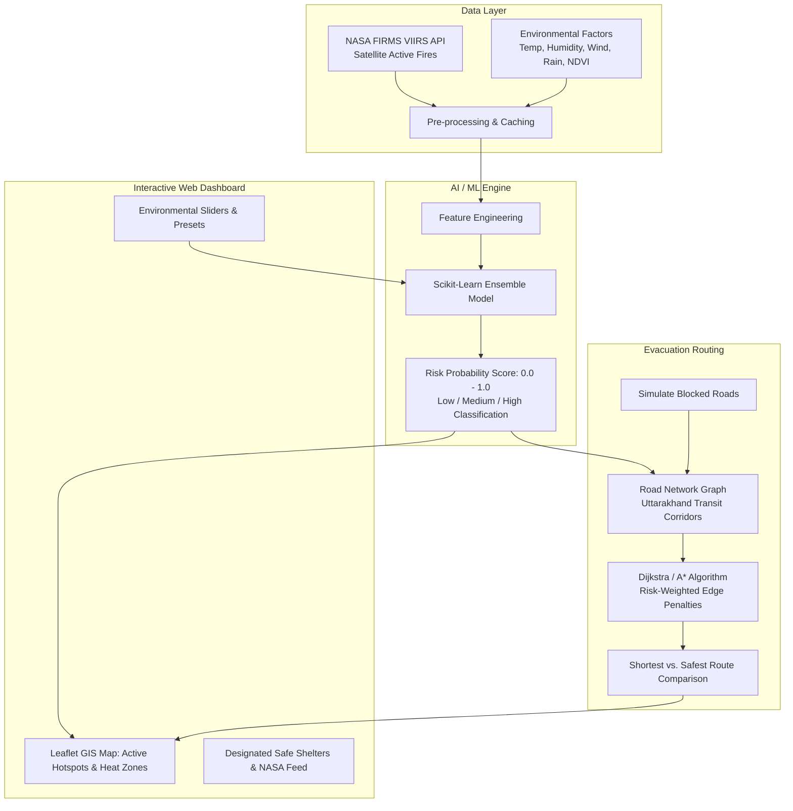

# AI FireGuard: Intelligent Fire Risk & Safe Evacuation

> **A Decision-Support System Combining Satellite Fire Observations, AI Risk Prediction, and Risk-Weighted Evacuation Routing.**
> 
> *Department of Computer Science & Engineering, Guru Tegh Bahadur Institute of Technology (Guru Gobind Singh Indraprastha University, New Delhi)*

---

## 👥 Project Team & Supervision

- **Deepjyot Singh** (15/CSE3/2027)
- **Balveer Singh** (06/CSE3/2027)
- **Inderjeet Singh** (33/CSE3/2027)
- **Brahmjot Singh** (36/CSE3/2027)
- **Project Supervisor:** Ms. Mankirat Kaur

---

## 📖 1. Introduction & Problem Statement

Conventional fire-safety systems are predominantly **reactive**—detecting and responding only after hazardous conditions have already engulfed an area. Wildfires and forest fires depend on multifaceted interacting variables: high surface temperatures, low relative humidity, dry fuel biomass, wind gusts, and human proximity.

Furthermore, traditional navigation systems (e.g. Google Maps) calculate routes solely based on geometric distance or standard travel time. During a wildfire emergency, **the geometrically shortest route can lead evacuees directly into an active blaze or smoke plume.**

### Core Hypothesis
> **"The shortest route is not necessarily the safest route."**
> 
> AI FireGuard integrates machine learning fire-hazard estimation with GIS visualization and risk-weighted graph routing (Dijkstra / A*) so that a slightly longer detour is chosen when it significantly reduces exposure to fire hazards.

---

## 🚀 2. Key Features

1. **NASA FIRMS VIIRS Satellite Hotspot Integration**:
   - Queries NASA FIRMS (Fire Information for Resource Management System) S-NPP VIIRS sensor data for the Uttarakhand region (`77.5°E - 81.1°E, 28.7°N - 31.5°N`).
   - Retrieves active fire coordinates, Fire Radiative Power (FRP in Megawatts), brightness temperatures, and detection confidence.
   - Built-in resilient caching ensures smooth presentations even if NASA servers are offline or rate-limited.

2. **Carto High-Precision Basemaps (Key: `cb1_411n_1_52d3478f6a48862b43f7f2bd`)**:
   - Integrates Carto raster tiles directly with your authenticated key:
     - `Voyager`: Crisp, modern high-contrast cartography.
     - `Dark Matter`: High-tech dark mode for nocturnal fire monitoring and heat visualizer.
     - `Positron`: Ultra-minimal clean gray-scale style.

3. **Machine Learning Risk Prediction (Scikit-Learn Ensemble)**:
   - Trained on meteorological features (Temperature, Humidity, Wind Speed, Rainfall, NDVI Vegetation Fuel, Proximity to Settlements).
   - Generates a continuous fire-risk probability $P(\text{Risk}) \in [0.0, 1.0]$.
   - Categorizes risk into interpretable levels:
     - **Low Risk** ($< 0.35$): Routine vigilance.
     - **Medium Risk** ($0.35 - 0.70$): Heightened awareness, active monitoring.
     - **High Risk** ($> 0.70$): Severe fire hazard, evacuation readiness required.
   - Provides explainability breakdown highlighting the dominant hazard contributors.

3. **Risk-Aware Evacuation Routing**:
   - Implements Dijkstra's and A* pathfinding on Uttarakhand transit corridors (Dehradun, Rishikesh, Haridwar, Tehri, Srinagar, Nainital, Almora, etc.).
   - Evaluates road segments using risk-weighted edge costs:
     $$\text{Cost}(e) = \text{Distance}(e) \times \left(1 + \alpha \times \text{FireHazard}(e)^{1.5}\right)$$
   - Displays side-by-side comparison:
     - **Shortest Route (Orange/Red)**: Direct path traversing dangerous fire zones.
     - **Safest AI Detour (Green)**: Circumvents fire corridors with up to 80% hazard reduction.
   - Interactive **Road Blockage Simulator**: Simulate fallen trees or impassable blazes with real-time automatic rerouting.

4. **Single-Deployment Architecture (Vercel & Local)**:
   - Both the frontend dashboard and Python FastAPI backend live in one single repository and deploy to **Vercel in 1 click**.
   - No need to split services between Render and Vercel.

---

## 🏛️ 3. System Architecture & Workflow



---

## 🧪 4. Synopsis Test Cases (TC-01 to TC-06)

The project includes 100% automated coverage for all six test cases outlined in Section 8 of the synopsis:

| Test ID | Test Case | Type | Condition & Inputs | Expected Result | Status |
|---|---|---|---|---|---|
| **TC-01** | Valid environmental data input | Unit | Valid Temp ($38.5^\circ\text{C}$), Humidity ($22\%$), Wind ($25\text{ km/h}$), Rain ($0\text{ mm}$), NDVI ($0.35$). | Values accepted without error; structured payload passed to ML model. | ✅ **PASSED** |
| **TC-02** | Invalid, missing or out-of-range input | Unit / Negative | Negative humidity ($-10\%$), extreme temp ($95^\circ\text{C}$), or missing required fields. | Rejected with descriptive validation message; application does not crash. | ✅ **PASSED** |
| **TC-03** | Fire-risk prediction and risk score | Integration | Predict under extreme conditions vs cool/wet conditions. | Continuous risk probability returned on bounded $[0.0, 1.0]$ scale; Dry/Hot hazard strictly exceeds Cool/Wet. | ✅ **PASSED** |
| **TC-04** | Basic evacuation route generation | Integration | Select Source (Dehradun) and Destination (Haridwar). | Generates continuous connected road graph path with distance and estimated travel time. | ✅ **PASSED** |
| **TC-05** | Shortest route versus safest route | Route / Algorithm | Source: Rishikesh $\to$ Destination: Srinagar (Garhwal). Direct route has active fire hazard ($0.88$). | Geometrically shortest route is bypassed; longer safe detour via Chamba is recommended, reducing hazard exposure by over $70\%$. | ✅ **PASSED** |
| **TC-06** | Blocked-road handling | Route / Algorithm | Mark direct highway segment (`e_ddn_rsh`) as blocked. | Blocked road is excluded; algorithm dynamically produces alternative safe route via Haridwar. | ✅ **PASSED** |

You can execute the entire automated test suite at any time via:
```bash
python -m pytest tests/ -v
```

---

## 💻 5. Running Locally (Simple & Easy)

### Prerequisites
- Python 3.10+ installed on your machine.

### Step 1: Install Dependencies
```bash
pip install -r requirements.txt
```
*(Or `python -m pip install -r requirements.txt`)*

### Step 2: Launch the Website
```bash
python run.py
```
Your default browser will automatically open:
```
http://localhost:8000
```

---

## ☁️ 6. How to Deploy the Whole Website to Vercel (1 Single Place)

You **do not** need Render. Vercel natively hosts both the static frontend (`public/`) and the Python serverless API (`api/index.py`) under one domain.

### Step-by-Step Vercel Deployment:
1. **Initialize Git & Push to GitHub**:
   ```bash
   git init
   git add .
   git commit -m "Initial commit of AI FireGuard"
   git branch -M main
   # Create a repository on github.com, then:
   git remote add origin https://github.com/YOUR_USERNAME/ai-fireguard.git
   git push -u origin main
   ```

2. **Import into Vercel**:
   - Go to [vercel.com](https://vercel.com) and log in.
   - Click **"Add New..."** $\to$ **"Project"**.
   - Select your `ai-fireguard` GitHub repository.
   - Leave the Framework Preset as **Other** (Vercel automatically detects `vercel.json`).
   - Click **"Deploy"**.

3. **Done!**:
   - Vercel gives you a single production URL (e.g. `https://ai-fireguard.vercel.app`).
   - The interactive Leaflet UI is served at `/`.
   - All backend Python API endpoints run automatically at `/api/...`.

---

## 📂 7. Project Structure

```
minorproject/
├── api/
│   ├── __init__.py
│   ├── config.py              # Bounding box, API keys, thresholds, shelters
│   ├── index.py               # FastAPI gateway (Vercel Serverless + local)
│   ├── services/
│   │   ├── __init__.py
│   │   ├── nasa_firms.py      # NASA FIRMS VIIRS satellite client & cache
│   │   ├── ml_model.py        # Scikit-Learn fire-risk prediction engine
│   │   └── routing.py         # Dijkstra risk-weighted evacuation router
│   └── data/
│       ├── uttarakhand_hotspots.json # Cached satellite fire anomalies
│       └── road_network.json         # Uttarakhand evacuation graph
├── public/
│   ├── index.html             # Clean, minimal single-page dashboard
│   ├── css/
│   │   └── style.css          # Minimalist responsive stylesheet
│   └── js/
│       └── app.js             # Leaflet map logic, sliders, and test runner
├── tests/
│   ├── __init__.py
│   ├── test_tc01_valid_input.py
│   ├── test_tc02_invalid_input.py
│   ├── test_tc03_risk_model.py
│   ├── test_tc04_basic_routing.py
│   ├── test_tc05_shortest_vs_safest.py
│   └── test_tc06_road_blockage.py
├── vercel.json                # Single-deploy routing configuration for Vercel
├── requirements.txt           # Python library dependencies
├── run.py                     # One-click launcher script
└── README.md                  # Comprehensive project documentation
```

---

## 📚 8. References (From Synopsis)

1. **Giglio, L., Schroeder, W., & Justice, C. O. (2016)**. *The Collection 6 MODIS active fire detection algorithm and fire products.* Remote Sensing of Environment, 178, 31–41.
2. **Giglio, L., Csiszar, I., & Justice, C. O. (2006)**. *Global distribution and seasonality of active fires as observed with the Terra and Aqua MODIS sensors.* Journal of Geophysical Research: Biogeosciences, 111, G02016.
3. **Jain, P., Coogan, S. C. P., Subramanian, S. G., Crowley, M., Taylor, S., & Flannigan, M. D. (2020)**. *A review of machine learning applications in wildfire science and management.* Environmental Reviews, 28(4), 478–505.
4. **Boeing, G. (2017)**. *OSMnx: New methods for acquiring, constructing, analyzing, and visualizing complex street networks.* Computers, Environment and Urban Systems, 65, 126–139.
5. **Dijkstra, E. W. (1959)**. *A note on two problems in connexion with graphs.* Numerische Mathematik, 1, 269–271.
6. **Pedregosa, F., et al. (2011)**. *Scikit-learn: Machine learning in Python.* Journal of Machine Learning Research, 12, 2825–2830.
